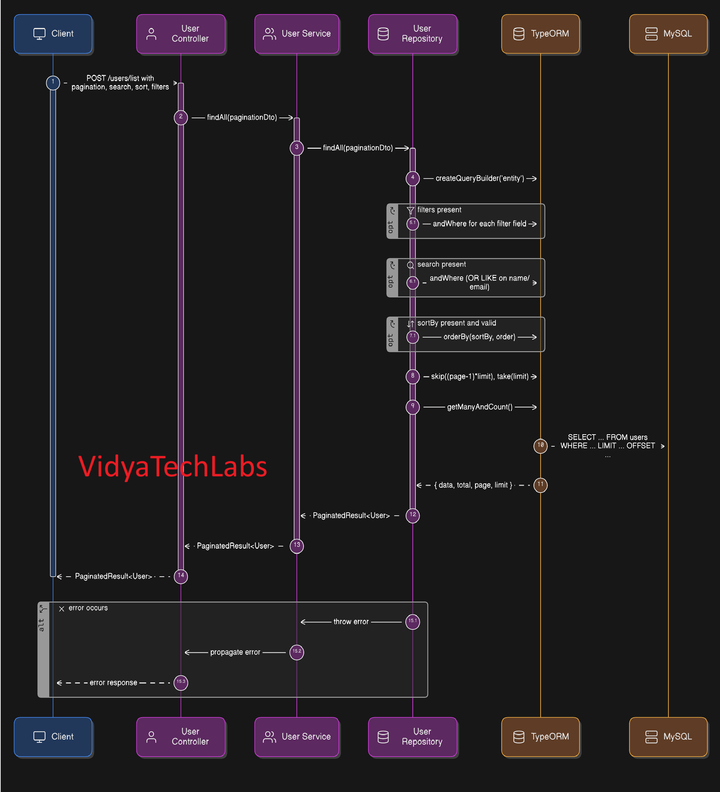

## **NestJS boilerplate** using **abstract classes** for controller, service, repository, and DTO with **pagination** (TypeORM + MySQL). This approach ensures you don’t duplicate CRUD logic across multiple entitiesProject setup

## Flow Chart:



```bash
$ npm install
```

## Compile and run the project

```bash
# development
$ npm run start

# watch mode
$ npm run start:dev

# production mode
$ npm run start:prod
```

## Run tests

```bash
# unit tests
$ npm run test

# e2e tests
$ npm run test:e2e

# test coverage
$ npm run test:cov
```

---

# 📂 Folder Structure

```plaintext
src/
│── main.ts
│── app.module.ts
│
├── common/
│   ├── controllers/
│   │   └── abstract.controller.ts
│   ├── dto/
│   │   └── pagination.dto.ts
│   ├── repositories/
│   │   └── abstract.repository.ts
│   ├── services/
│   │   └── abstract.service.ts
│
├── user/
│   ├── dto/
│   │   ├── create-user.dto.ts
│   │   └── update-user.dto.ts
│   ├── entities/
│   │   └── user.entity.ts
│   ├── user.repository.ts
│   ├── user.service.ts
│   ├── user.controller.ts
│   └── user.module.ts
│
└── database/
    └── typeorm.config.ts
```

---

# 📦 Package Installation

```bash
npm install @nestjs/common @nestjs/core @nestjs/typeorm @nestjs/config typeorm mysql2 class-validator class-transformer reflect-metadata rxjs
npm install -D @types/node
```

---

# ⚙️ Core Files

### `main.ts`

```ts
import { ValidationPipe } from '@nestjs/common';
import { NestFactory } from '@nestjs/core';
import { AppModule } from './app.module';

async function bootstrap() {
  const app = await NestFactory.create(AppModule);
  app.useGlobalPipes(new ValidationPipe({ whitelist: true, transform: true }));
  await app.listen(3000);
}
bootstrap();
```

### `app.module.ts`

```ts
import { Module } from '@nestjs/common';
import { ConfigModule } from '@nestjs/config';
import { TypeOrmModule } from '@nestjs/typeorm';
import typeOrmConfig from './database/typeorm.config';
import { UserModule } from './user/user.module';

@Module({
  imports: [
    ConfigModule.forRoot({ isGlobal: true }),
    TypeOrmModule.forRoot(typeOrmConfig),
    UserModule,
  ],
})
export class AppModule {}
```

### `database/typeorm.config.ts`

```ts
import { TypeOrmModuleOptions } from '@nestjs/typeorm';

const typeOrmConfig: TypeOrmModuleOptions = {
  type: 'mysql',
  host: process.env.DB_HOST || 'localhost',
  port: parseInt(process.env.DB_PORT || '3306', 10),
  username: process.env.DB_USER || 'root',
  password: process.env.DB_PASS || 'password',
  database: process.env.DB_NAME || 'test_db',
  autoLoadEntities: true,
  synchronize: true, // ⚠️ Only for dev
};

export default typeOrmConfig;
```

---

# 🛠 Common Layer

### `common/dto/pagination.dto.ts`

```ts
import { Type } from 'class-transformer';
import { IsInt, IsOptional, Min, IsIn, IsObject } from 'class-validator';

export class AbstractPaginationDto {
  @Type(() => Number)
  @IsInt()
  @Min(1)
  page: number = 1;

  @Type(() => Number)
  @IsInt()
  @Min(1)
  limit: number = 10;

  @IsOptional()
  search?: string;

  @IsOptional()
  sortBy?: string;

  @IsOptional()
  @IsIn(['ASC', 'DESC'])
  order?: 'ASC' | 'DESC' = 'ASC';

  @IsOptional()
  @IsObject()
  filters?: Record<string, any>;
}

export interface PaginatedResult<T> {
  data: T[];
  total: number;
  page: number;
  limit: number;
}
```

### `common/repositories/abstract.repository.ts`

```ts
import { Repository, SelectQueryBuilder } from 'typeorm';
import { AbstractPaginationDto, PaginatedResult } from '../dto/pagination.dto';
import { QueryDeepPartialEntity } from 'typeorm/query-builder/QueryPartialEntity';

export abstract class AbstractRepository<T extends { id: number }> {
  protected constructor(protected readonly repository: Repository<T>) {}

  protected abstract getSearchableColumns(): (keyof T)[];
  protected abstract getSortableColumns(): (keyof T)[];

  async findAll(pagination: AbstractPaginationDto): Promise<PaginatedResult<T>> {
    const { page, limit, search, sortBy, order, filters } = pagination;

    const qb: SelectQueryBuilder<T> = this.repository.createQueryBuilder('entity');

    // Filters
    if (filters) {
      Object.entries(filters).forEach(([key, value]) => {
        qb.andWhere(`entity.${key} = :${key}`, { [key]: value });
      });
    }

    // Search
    if (search) {
      const searchable = this.getSearchableColumns();
      if (searchable.length > 0) {
        qb.andWhere(
          searchable
            .map((col) => `entity.${String(col)} LIKE :search`)
            .join(' OR '),
          { search: `%${search}%` },
        );
      }
    }

    // Sorting
    if (sortBy && this.getSortableColumns().includes(sortBy as keyof T)) {
      qb.orderBy(`entity.${sortBy}`, order || 'ASC');
    }

    // Pagination
    qb.skip((page - 1) * limit).take(limit);

    const [data, total] = await qb.getManyAndCount();

    return { data, total, page, limit };
  }

  async findOne(id: number): Promise<T | null> {
    return this.repository.findOne({ where: { id } as any });
  }

  async create(entity: Partial<T>): Promise<T> {
    return this.repository.save(this.repository.create(entity as T));
  }

  async update(id: number, entity: QueryDeepPartialEntity<T>): Promise<T> {
    await this.repository.update(id, entity);
    return (await this.findOne(id)) as T;
  }

  async delete(id: number): Promise<void> {
    await this.repository.delete(id);
  }
}
```

### `common/services/abstract.service.ts`

```ts
import { AbstractPaginationDto } from '../dto/pagination.dto';
import { AbstractRepository } from '../repositories/abstract.repository';
import { QueryDeepPartialEntity } from 'typeorm/query-builder/QueryPartialEntity';

export abstract class AbstractService<T extends { id: number }> {
  protected constructor(protected readonly repository: AbstractRepository<T>) {}

  async findAll(pagination: AbstractPaginationDto) {
    return this.repository.findAll(pagination);
  }

  async findOne(id: number) {
    return this.repository.findOne(id);
  }

  async create(data: Partial<T>) {
    return this.repository.create(data);
  }

  async update(id: number, data: QueryDeepPartialEntity<T>) {
    return this.repository.update(id, data);
  }

  async delete(id: number) {
    return this.repository.delete(id);
  }
}
```

### `common/controllers/abstract.controller.ts`

```ts
import { Body, Delete, Get, Param, ParseIntPipe, Post, Put } from '@nestjs/common';
import { AbstractService } from '../services/abstract.service';
import { AbstractPaginationDto } from '../dto/pagination.dto';
import { QueryDeepPartialEntity } from 'typeorm/query-builder/QueryPartialEntity';

export abstract class AbstractController<
  T extends { id: number },
  CreateDto = any,
  UpdateDto = any,
> {
  protected constructor(protected readonly service: AbstractService<T>) {}

  // ✅ POST for advanced listing
  @Post('list')
  async findAll(@Body() pagination: AbstractPaginationDto) {
    return this.service.findAll(pagination);
  }

  @Get(':id')
  async findOne(@Param('id', ParseIntPipe) id: number) {
    return this.service.findOne(id);
  }

  @Post()
  async create(@Body() dto: CreateDto) {
    return this.service.create(dto as Partial<T>);
  }

  @Put(':id')
  async update(
    @Param('id', ParseIntPipe) id: number,
    @Body() dto: UpdateDto,
  ) {
    return this.service.update(id, dto as QueryDeepPartialEntity<T>);
  }

  @Delete(':id')
  async delete(@Param('id', ParseIntPipe) id: number) {
    return this.service.delete(id);
  }
}
```

---

# 👤 User Module Example

### `user/entities/user.entity.ts`

```ts
import { Entity, PrimaryGeneratedColumn, Column, CreateDateColumn } from 'typeorm';

@Entity('users')
export class User {
  @PrimaryGeneratedColumn()
  id: number;

  @Column()
  name: string;

  @Column({ unique: true })
  email: string;

  @Column({ default: true })
  isActive: boolean;

  @CreateDateColumn()
  createdAt: Date;
}
```

### `user/dto/create-user.dto.ts`

```ts
import { IsEmail, IsNotEmpty } from 'class-validator';

export class CreateUserDto {
  @IsNotEmpty()
  name: string;

  @IsEmail()
  email: string;
}
```

### `user/dto/update-user.dto.ts`

```ts
import { IsEmail, IsOptional } from 'class-validator';

export class UpdateUserDto {
  @IsOptional()
  name?: string;

  @IsOptional()
  @IsEmail()
  email?: string;

  @IsOptional()
  isActive?: boolean;
}
```

### `user/user.repository.ts`

```ts
import { Injectable } from '@nestjs/common';
import { InjectRepository } from '@nestjs/typeorm';
import { Repository } from 'typeorm';
import { AbstractRepository } from '../common/repositories/abstract.repository';
import { User } from './entities/user.entity';

@Injectable()
export class UserRepository extends AbstractRepository<User> {
  constructor(@InjectRepository(User) repo: Repository<User>) {
    super(repo);
  }

  protected getSearchableColumns(): (keyof User)[] {
    return ['name', 'email'];
  }

  protected getSortableColumns(): (keyof User)[] {
    return ['id', 'name', 'email', 'createdAt'];
  }
}
```

### `user/user.service.ts`

```ts
import { Injectable } from '@nestjs/common';
import { AbstractService } from '../common/services/abstract.service';
import { User } from './entities/user.entity';
import { UserRepository } from './user.repository';

@Injectable()
export class UserService extends AbstractService<User> {
  constructor(private readonly userRepo: UserRepository) {
    super(userRepo);
  }
}
```

### `user/user.controller.ts`

```ts
import { Controller } from '@nestjs/common';
import { AbstractController } from '../common/controllers/abstract.controller';
import { User } from './entities/user.entity';
import { UserService } from './user.service';
import { CreateUserDto } from './dto/create-user.dto';
import { UpdateUserDto } from './dto/update-user.dto';

@Controller('users')
export class UserController extends AbstractController<
  User,
  CreateUserDto,
  UpdateUserDto
> {
  constructor(private readonly userService: UserService) {
    super(userService);
  }
}
```

### `user/user.module.ts`

```ts
import { Module } from '@nestjs/common';
import { TypeOrmModule } from '@nestjs/typeorm';
import { User } from './entities/user.entity';
import { UserRepository } from './user.repository';
import { UserService } from './user.service';
import { UserController } from './user.controller';

@Module({
  imports: [TypeOrmModule.forFeature([User])],
  providers: [UserRepository, UserService],
  controllers: [UserController],
})
export class UserModule {}
```

---

# Running the Project

```bash
npm run start:dev
```

1. Make sure you have **MySQL running**:

   ```bash
   docker run --name mysql -e MYSQL_ROOT_PASSWORD=password -e MYSQL_DATABASE=test_db -p 3306:3306 -d mysql:8
   ```
2. Start the NestJS app:

   ```bash
   npm run start:dev
   ```
3. Endpoints available:

   * `GET /users?page=1&limit=10`
   * `GET /users/1`
   * `POST /users { "name": "John", "email": "john@example.com" }`
   * `PUT /users/1 { "name": "Updated" }`
   * `DELETE /users/1`

### Example Request (Postman)

```http
POST http://localhost:3000/users/list
Content-Type: application/json

{
  "page": 1,
  "limit": 10,
  "search": "john",
  "sortBy": "createdAt",
  "order": "DESC",
  "filters": {
    "isActive": true
  }
}
```

---

Working code that adds **searching, sorting, and filtering** to the abstract listing logic.

Quick summary:

* `AbstractPaginationDto` now accepts `search`, `sortBy`, `order`, and `filters` (JSON string).
* `AbstractRepository.findAll()` uses a TypeORM `QueryBuilder` to apply:

  * exact `filters` (JSON parsed),
  * `search` (LIKE across searchable columns — OR combined),
  * `sortBy`/`order` (only allowed when included in the repository's `getSortableColumns()`).
* Concrete repos (e.g., `UserRepository`) override:

  * `getSearchableColumns()` → `['name','email']`
  * `getSortableColumns()` → `['id','name','email','createdAt']`
* Examples for queries are in the document (and note: `filters` should be URL-encoded JSON).

---
